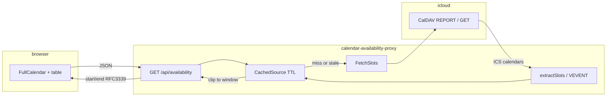

# Data flow: iCloud → API → browser

This document describes how busy intervals move from the configured iCloud calendar through the Go service to what visitors see on the page.

## Overview



## 1. Startup (what is wired once)

1. **Config** (`internal/config/config.go`) loads environment: iCloud credentials, `CALENDAR_ID`, optional `CALDAV_BASE_URL`, cache TTL, rate limits, `EVENT_PARSE_TIMEZONE`, `SKIP_TRANSPARENT`, etc.
2. **CalDAV client** (`internal/icloud/client.go`): HTTP client with Basic Auth (Apple ID + app-specific password) and a Calendar-style `User-Agent` (iCloud often returns 403 for generic agents).
3. **Calendar path** (`icloud.ResolveCalendarPath`): resolves `CALENDAR_ID` to a full collection path under the user’s calendar home (or accepts an absolute path if you paste one).
4. **CachedSource** (`internal/availability/cache.go`): wraps the client + normalized path + TTL + parse options.
5. **HTTP router** (`internal/httpapi/server.go`): registers `GET /api/availability`, `GET /healthz`, static `/` (embedded `web/index.html`), and optionally diagnostics.

## 2. Query window (time range for CalDAV and clipping)

`availability.QueryWindow(loc, now)` (`internal/availability/window.go`):

- **Timezone:** `Europe/Skopje` (fixed in `cmd/server/main.go` for this service).
- **Start:** Monday 00:00 in that timezone for the week containing `now` (ISO week: Monday first day).
- **End:** start + **31 days** (constant `horizonDays`).

Every availability request uses this same window for fetching and filtering. The API also exposes the calendar dates of that window in response headers (see below).

## 3. HTTP: `GET /api/availability`

Handler: `internal/httpapi/server.go` → `handleAvailability`.

1. **Optional cache bypass:** query `fresh=1` or `refresh=1` calls `CachedSource.Invalidate()` so the next read refetches from iCloud (still subject to per-IP rate limiting).
2. **Timeout:** request context capped at 55s.
3. **Data:** `CachedSource.Slots(ctx, queryStart, queryEnd)` with the window from step 2.
4. **Past intervals dropped:** slots whose **end** is not after “now” (Skopje) are removed before JSON encoding — only future (or ongoing) busy intervals are returned.
5. **Errors:** client receives `502` with body `upstream calendar unavailable` (no internal error strings).
6. **Headers:**
   - `Content-Type: application/json`
   - `X-Availability-Window-Start-Date` / `X-Availability-Window-End-Date`: `YYYY-MM-DD` in Skopje (for FullCalendar `validRange`).
   - `Cache-Control`: `private, max-age=60` normally; `private, no-store` when `fresh=1` / `refresh=1`.

## 4. In-memory cache

`CachedSource.Slots` (`internal/availability/cache.go`):

- On a **hit** (age &lt; TTL, no previous fetch error): returns **cached** slots **clipped** again to `[queryStart, queryEnd)` via `clipSlots` (overlap test).
- On **miss** or after invalidate: calls `FetchSlots`, stores result + timestamp; errors are remembered briefly (`errCooldown`, 30s) to avoid hammering iCloud on repeated failures.
- TTL default comes from config (e.g. `CACHE_TTL_SECONDS` on Render).

## 5. Fetching from iCloud (`FetchSlots`)

Implementation: `internal/availability/slots.go` → `FetchSlots`.

CalDAV calls use the **same** `[queryStart, queryEnd)` converted to **UTC** for `calendar-query` filters and optional expand.

**Strategy (in order):**

1. **Calendar-query (plain, no recurrence expand)**  
   `QueryCalendar` with a REPORT body built by `calendarQuery(startUTC, endUTC, false)`.  
   Rationale: iCloud sometimes returns expanded REPORT payloads that parse but produce no usable instants; plain query often matches a typical `.ics` shape.

2. **Hydration**  
   `HydrateCalendarObjectsIfNeeded`: for each returned object, if a `VEVENT` exists but **DTSTART** is missing in the REPORT payload, the code **GET**s the full resource by path and substitutes it (iCloud quirk).

3. **Parse**  
   `extractSlots` on the (possibly hydrated) objects.

4. **If zero slots:** repeat with **calendar-query + expand** (`expand: true`) so recurrence expansion is done server-side where supported, then hydrate + `extractSlots` again.

5. **If still zero slots:** **fallback** `fetchSlotsByListing` — `ReadDir` on the calendar collection (shallow, then recursive if needed), then `GetCalendarObject` per file (cap 800 objects), each parsed with `extractSlots`.

Slots from all paths are **sorted** by start time before return.

## 6. Parsing ICS → busy intervals

Still `internal/availability/slots.go`.

- **Input:** `[]caldav.CalendarObject` with `Data` as `*ical.Calendar` (VCOMPONENT tree).
- **Walk:** all components; for each **`VEVENT`**, `slotsFromVEVENT` runs.
- **Dropped events:**
  - `STATUS:CANCELLED`
  - If `SKIP_TRANSPARENT` is enabled (config): `TRANSP:TRANSPARENT` (free/busy “transparent” blocks).
- **Single instances:** `DTSTART` parsed with `eventParseLoc` for **floating** times (no `Z` / no `TZID`); end from `DTEND`, or `DURATION`, or all-day rule (`VALUE=DATE` → end = start + 1 day). Must overlap `[queryStart, queryEnd)`.
- **Recurring:** if `RRULE` parses, `RecurrenceSet` + `Between(queryStart, queryEnd)`; each instance gets the same duration as the master; capped at `maxRecurrenceInstances` (2048).
- **Dedup:** identical `(start,end)` in UTC nanoseconds collapsed via `dedupeSlots`.

**What is intentionally not exposed:** event **SUMMARY**, **DESCRIPTION**, **LOCATION**, attendees — only time geometry becomes `Slot{Start, End}`.

## 7. JSON shape to the browser

Array of objects:

```json
[
  { "start": "2026-04-10T14:00:00+02:00", "end": "2026-04-10T16:00:00+02:00" }
]
```

Times are **RFC3339** with offset, in **Europe/Skopje** (formatted in the handler with `time.RFC3339` after `In(loc)`).

## 8. What the page shows (`internal/httpapi/web/index.html`)

- **Source:** `fetch("/api/availability")` on load; `fetch("/api/availability?fresh=1")` on **Refresh**, every **120s** while the tab is visible, and when the tab becomes visible again.
- **Timezone in UI:** hardcoded `Europe/Skopje` for FullCalendar and `Intl` formatters.
- **FullCalendar:**
  - Each interval is one event: **title `"Booked"`**, class `booked-bg` (styling only; real calendar titles are not sent).
  - `validRange` is set from `X-Availability-Window-*` headers so navigation stays inside the server window.
  - Responsive default view: Day (&lt;600px), 3-day (&lt;768px), Week (≥768px); list “Agenda” available; hours roughly 09:00–24:00 grid; no create/edit (read-only).
- **Table below:** same rows sorted by start — columns **Date**, **Start**, **End**, **Duration** (human-readable), Skopje timezone.
- **Errors:** generic “Could not load availability” if the request fails.

## 9. Optional parallel path (diagnostics)

If `CALDAV_DIAGNOSTICS=1`, `GET /api/diagnostics/caldav` returns a JSON probe (steps, paths, counts). **Not** used by the public UI; keep disabled on public deployments.

## File map (quick reference)

| Stage            | Package / file |
|------------------|----------------|
| Entry + Skopje TZ | `cmd/server/main.go` |
| Env + TTL + flags | `internal/config/config.go` |
| CalDAV client    | `internal/icloud/client.go` |
| Cache + clip     | `internal/availability/cache.go` |
| Window Mon+31d   | `internal/availability/window.go` |
| Fetch + parse    | `internal/availability/slots.go` |
| HTTP + JSON      | `internal/httpapi/server.go` |
| Page + FullCalendar | `internal/httpapi/web/index.html` |
